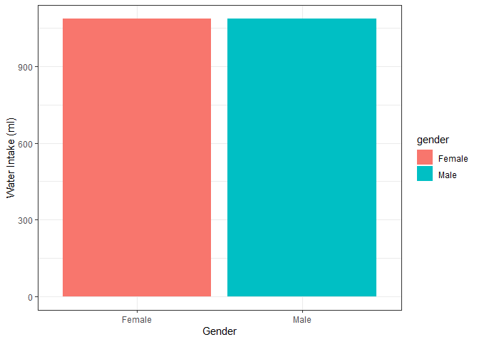
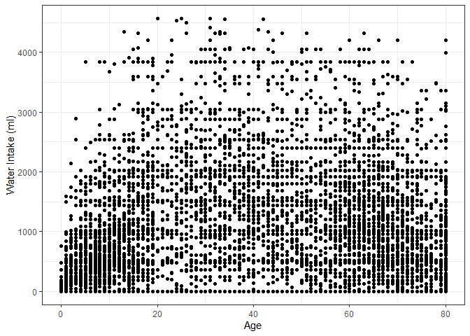
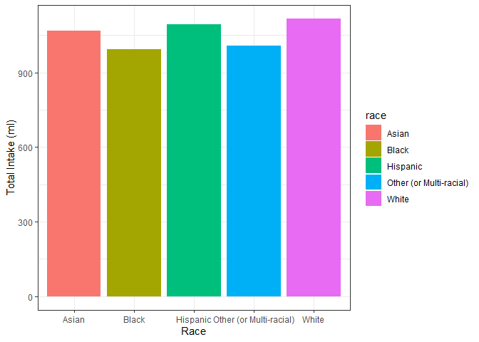
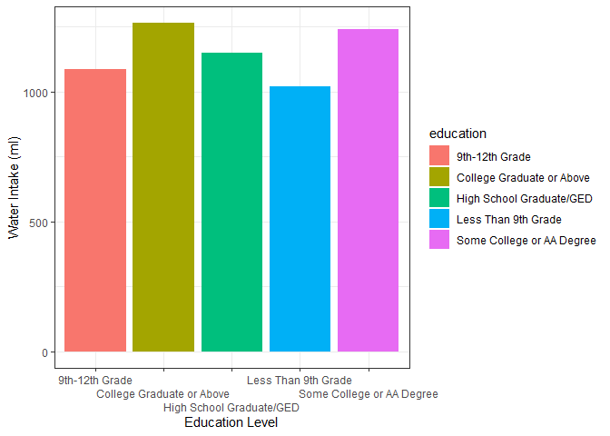
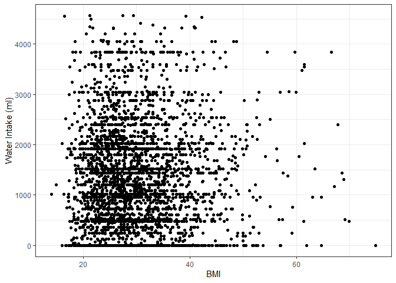
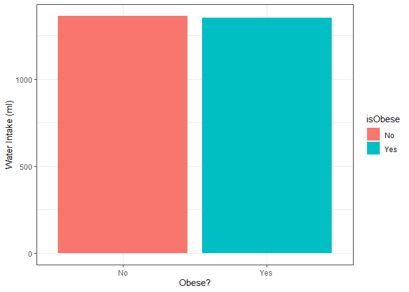
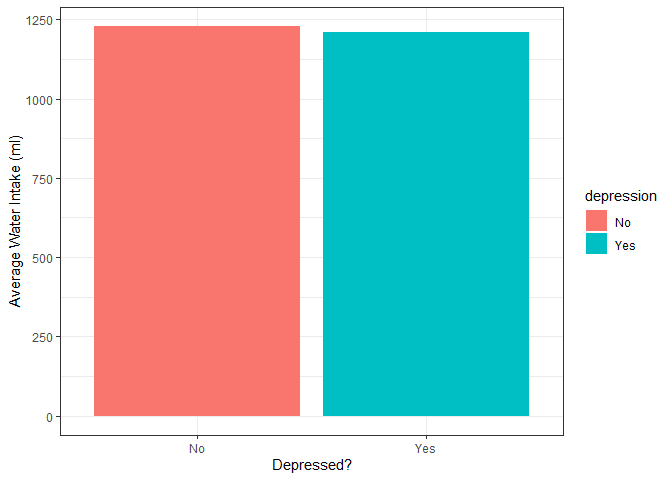
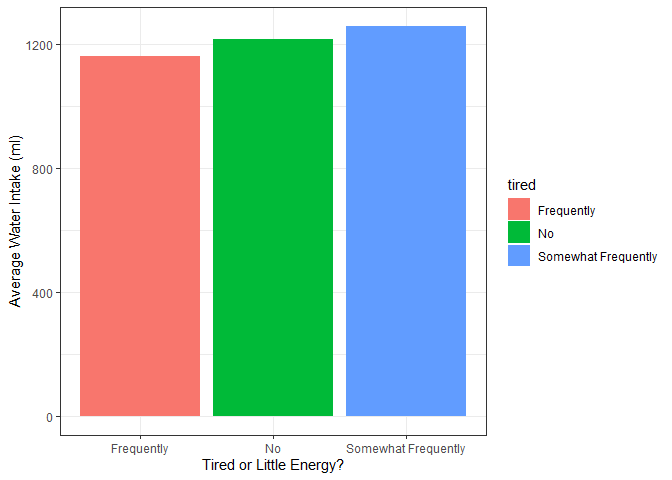

Untitled
================

# Navigation

- [Demographics](#demographics)
  - [Average Water Intake Per Person](#average-water-intake-per-person)
  - [Average Water Intake by Gender](#average-water-intake-by-gender)
  - [Water Intake by Age](#water-intake-by-age)
  - [Average Water Intake by Race](#race)
  - [Average Water Intake by Education](#education)
- [Water Intake and BMI](#water-intake-and-bmi)
  - [Linear Relationship](#linear-relationship)
  - [Water Intake and Obsesity](#and-obesity)
  - [Including Confounds](#add-confounds)
- [Mental Health](#mental-health)
  - [Depression](#depression)
  - [Tired or Little Energy](#tired-or-little-energy)

# Data loading and merging

## Read data

``` r
library(dplyr)
```

    ## 
    ## Attaching package: 'dplyr'

    ## The following objects are masked from 'package:stats':
    ## 
    ##     filter, lag

    ## The following objects are masked from 'package:base':
    ## 
    ##     intersect, setdiff, setequal, union

``` r
library(ggplot2)
theme_set(theme_bw())

diet <- readRDS('./data/total_dietary_intake.rds')
demographics <- readRDS('./data/demographics.rds')
body_measures <- readRDS('./data/body_measures.rds')
depression <- readRDS('./data/depression.rds')
income <- readRDS('./data/income.rds')
```

## Join data

These are all combined on the total nutrient intake data set so that the
analysis centers on respondents’ water intake

- [Dietary Interview - Total Nutrient Intakes, First
  Day](https://wwwn.cdc.gov/Nchs/Data/Nhanes/Public/2021/DataFiles/DR1TOT_L.htm)
- [Demographics](https://wwwn.cdc.gov/Nchs/Data/Nhanes/Public/2021/DataFiles/DEMO_L.htm)
- [Examination data collected for body
  measures](https://wwwn.cdc.gov/Nchs/Data/Nhanes/Public/2021/DataFiles/BMX_L.htm)
  (for BMI)
- [Questionnaire:
  Depression](https://wwwn.cdc.gov/Nchs/Data/Nhanes/Public/2021/DataFiles/DPQ_L.htm)
- Income

``` r
### Merge Data
df <- diet %>%
  left_join(demographics, by = join_by(SEQN)) %>%
  left_join(body_measures, by = join_by(SEQN)) %>%
  left_join(depression, by = join_by(SEQN)) %>%
  left_join(income, by = join_by(SEQN))

### Keep only rows where water intake was measured
df <- df %>%
  filter(!is.na(DR1_320Z))

rm(diet, demographics, body_measures, depression, income)
```

The only variable for water intake we need is `DR1_320Z` -
`Total plain water drank yesterday (gm)`, so we can just rename it to
“water”

Total plain water includes both tap water and bottled water.

``` r
df <- df %>%
  rename(water = DR1_320Z)
```

For cleaner analyses and graphing, let’s also remove outliers of \> 3
standard deviations

``` r
df <- df %>%
  mutate(water_z = scale(water)) %>%
  filter(water_z < 3)
```

    ## Warning: Using one column matrices in `filter()` was deprecated in dplyr 1.1.0.
    ## ℹ Please use one dimensional logical vectors instead.
    ## This warning is displayed once every 8 hours.
    ## Call `lifecycle::last_lifecycle_warnings()` to see where this warning was
    ## generated.

# Demographics

## Average Water Intake Per Person

``` r
df %>%
  summarize(`Average Water Intake` = mean(water))
```

    ##   Average Water Intake
    ## 1             1086.712

On the average day, the average American drinks **1087ml** of water.

## Average Water Intake by Gender

``` r
df$gender <- ifelse(df$RIAGENDR == 1, 'Male', 'Female')

df %>%
  group_by(gender) %>%
  summarize(water = mean(water)) %>%
  ggplot(aes(x = gender, y = water, fill = gender)) +
  geom_bar(stat = 'identity') +
  labs(x = 'Gender', y = 'Water Intake (ml)')
```

<!-- -->

There doesn’t seem to be a significant different between genders in
water intake.

## Water Intake by Age

``` r
ggplot(aes(x = RIDAGEYR, y = water), data = df) +
  geom_point() +
  labs(x = 'Age', y = 'Water Intake (ml)')
```

<!-- -->

It doesn’t look like age is a factor in water intake

## Race

``` r
df <- df %>%
  mutate(
    race = case_when(
      RIDRETH3 == 1 | RIDRETH3 == 2 ~ 'Hispanic',
      RIDRETH3 == 3 ~ 'White',
      RIDRETH3 == 4 ~ 'Black',
      RIDRETH3 == 6 ~ 'Asian',
      RIDRETH3 == 7 ~ 'Other (or Multi-racial)'
    )
  )

df %>%
  group_by(race) %>%
  summarize(water = mean(water)) %>%
  ggplot(aes(x = race, y = water, fill = race)) +
    geom_bar(stat = 'identity') +
    labs(x = 'Race', y = 'Total Intake (ml)')
```

<!-- -->

Water intake seems pretty consistent across races

## Education

``` r
df2 <- df %>%
  filter(!is.na(DMDEDUC2))

df2 <- df2 %>%
  mutate(
    education = case_when(
      DMDEDUC2 == 1 ~ 'Less Than 9th Grade',
      DMDEDUC2 == 2 ~ '9th-12th Grade',
      DMDEDUC2 == 3 ~ 'High School Graduate/GED',
      DMDEDUC2 == 4 ~ 'Some College or AA Degree',
      DMDEDUC2 == 5 ~ 'College Graduate or Above'
    )
  )

df2 %>%
  group_by(education) %>%
  summarize(water = mean(water)) %>%
  ggplot(aes(x = education, y = water, fill = education)) +
    geom_bar(stat = 'identity') +
    scale_x_discrete(guide = guide_axis(n.dodge=3)) +
    labs(x = 'Education Level', y = 'Water Intake (ml)')
```

<!-- -->

There doesn’t seem to be a link between education level and water
intake.

# Water Intake and BMI

There is an [established
link](https://pmc.ncbi.nlm.nih.gov/articles/PMC4940461/) between water
intake and BMI.

Let’s see if this is the case with the most recent data.

## Linear Relationship

``` r
df2 <- df %>%
  filter(!is.na(BMXBMI)) %>%
  filter(RIDAGEYR >= 18 & RIDAGEYR < 65) # Study was aged 18-64

ggplot(aes(x = BMXBMI, y = water), data = df2) +
  geom_point() +
  labs(x = 'BMI', y = 'Water Intake (ml)')
```

<!-- -->

It’s really hard to tell if there’s a relationship, so let’s try
modeling it.

``` r
model <- lm(BMXBMI ~ water, data = df2)
summary(model)
```

    ## 
    ## Call:
    ## lm(formula = BMXBMI ~ water, data = df2)
    ## 
    ## Residuals:
    ##     Min      1Q  Median      3Q     Max 
    ## -15.874  -5.577  -1.506   4.139  44.923 
    ## 
    ## Coefficients:
    ##              Estimate Std. Error t value Pr(>|t|)    
    ## (Intercept) 2.988e+01  2.295e-01 130.189   <2e-16 ***
    ## water       9.493e-05  1.341e-04   0.708    0.479    
    ## ---
    ## Signif. codes:  0 '***' 0.001 '**' 0.01 '*' 0.05 '.' 0.1 ' ' 1
    ## 
    ## Residual standard error: 7.867 on 3169 degrees of freedom
    ## Multiple R-squared:  0.0001582,  Adjusted R-squared:  -0.0001573 
    ## F-statistic: 0.5014 on 1 and 3169 DF,  p-value: 0.4789

The model is not significant and the $R^2$ value is incredibly small.

## And Obesity

Another hypothesis might be whether low water intake is an indicator of
obesity.

``` r
df2$isObese <- ifelse(df2$BMXBMI > 30, 'Yes', 'No')

df2 %>%
  group_by(isObese) %>%
  summarize(water = mean(water)) %>%
  ggplot(aes(x = isObese, y = water, fill = isObese)) +
    geom_bar(stat = 'identity') +
    labs(x = 'Obese?', y = 'Water Intake (ml)')
```

<!-- -->

This follows the lack of pattern seen above.

``` r
df2$isObeseCode <- ifelse(df2$isObese == 'Yes', 1, 0)

model <- glm(isObeseCode ~ water, data = df2, family = 'binomial')
summary(model)
```

    ## 
    ## Call:
    ## glm(formula = isObeseCode ~ water, family = "binomial", data = df2)
    ## 
    ## Coefficients:
    ##               Estimate Std. Error z value Pr(>|z|)    
    ## (Intercept) -3.173e-01  5.911e-02  -5.368 7.96e-08 ***
    ## water       -7.677e-06  3.456e-05  -0.222    0.824    
    ## ---
    ## Signif. codes:  0 '***' 0.001 '**' 0.01 '*' 0.05 '.' 0.1 ' ' 1
    ## 
    ## (Dispersion parameter for binomial family taken to be 1)
    ## 
    ##     Null deviance: 4311.9  on 3170  degrees of freedom
    ## Residual deviance: 4311.9  on 3169  degrees of freedom
    ## AIC: 4315.9
    ## 
    ## Number of Fisher Scoring iterations: 4

## Add Confounds

The model used in the paper cited at the beginning of the section used
the confounds of `age`, `race`, `sex`, and `income-to-poverty ratio`.
Let’s see what the models look like when these confounds are added.

``` r
library(effectsize)
```

    ## Warning: package 'effectsize' was built under R version 4.4.3

``` r
library(car)
```

    ## Warning: package 'car' was built under R version 4.4.3

    ## Loading required package: carData

    ## Warning: package 'carData' was built under R version 4.4.3

    ## 
    ## Attaching package: 'car'

    ## The following object is masked from 'package:dplyr':
    ## 
    ##     recode

``` r
model <- lm(BMXBMI ~ water + RIDAGEYR + race + gender + INDFMMPC, data = df2)
summary(model)
```

    ## 
    ## Call:
    ## lm(formula = BMXBMI ~ water + RIDAGEYR + race + gender + INDFMMPC, 
    ##     data = df2)
    ## 
    ## Residuals:
    ##     Min      1Q  Median      3Q     Max 
    ## -15.767  -5.239  -1.363   3.906  44.608 
    ## 
    ## Coefficients:
    ##                               Estimate Std. Error t value Pr(>|t|)    
    ## (Intercept)                 23.2031529  0.8414067  27.577  < 2e-16 ***
    ## water                        0.0002946  0.0001380   2.135  0.03288 *  
    ## RIDAGEYR                     0.0664293  0.0101363   6.554 6.61e-11 ***
    ## raceBlack                    6.4258342  0.7312767   8.787  < 2e-16 ***
    ## raceHispanic                 4.5037567  0.6879713   6.546 6.93e-11 ***
    ## raceOther (or Multi-racial)  4.8815475  0.8350580   5.846 5.60e-09 ***
    ## raceWhite                    4.5303110  0.6360386   7.123 1.33e-12 ***
    ## genderMale                  -0.9436327  0.2867604  -3.291  0.00101 ** 
    ## INDFMMPC                    -0.2646694  0.1263392  -2.095  0.03626 *  
    ## ---
    ## Signif. codes:  0 '***' 0.001 '**' 0.01 '*' 0.05 '.' 0.1 ' ' 1
    ## 
    ## Residual standard error: 7.691 on 2931 degrees of freedom
    ##   (231 observations deleted due to missingness)
    ## Multiple R-squared:  0.0481, Adjusted R-squared:  0.0455 
    ## F-statistic: 18.51 on 8 and 2931 DF,  p-value: < 2.2e-16

``` r
anova_table <- Anova(model, type = 2)  # or type = 3 for Type III SS

# Calculate partial eta squared
eta_squared(anova_table, partial = TRUE)
```

    ## # Effect Size for ANOVA (Type II)
    ## 
    ## Parameter | Eta2 (partial) |       95% CI
    ## -----------------------------------------
    ## water     |       1.55e-03 | [0.00, 1.00]
    ## RIDAGEYR  |           0.01 | [0.01, 1.00]
    ## race      |           0.03 | [0.02, 1.00]
    ## gender    |       3.68e-03 | [0.00, 1.00]
    ## INDFMMPC  |       1.50e-03 | [0.00, 1.00]
    ## 
    ## - One-sided CIs: upper bound fixed at [1.00].

Water intake is now a statistically significant predictor of BMI, but
the effect size is very small.

This is particularly import to take into consideration because of how
p-values are calculated: using the standard error - which is in turn
dependent on n.

- n here is 3171
- n for the paper is 9528

# Mental Health

## Depression

For this we’ll label depressed as having felt down, depressed, or
hopeless several times or more over the last two weeks.

``` r
df <- df %>%
  mutate(
    depression = case_when(
      DPQ020 == 0 ~ 'No',
      DPQ020 %in% c(1, 2, 3) ~ 'Yes',
      .default = 'remove'
    )
  )
df2 <- df %>%
  filter(depression != 'remove')

df2 %>%
  group_by(depression) %>%
  summarize(water = mean(water)) %>%
  ggplot(aes(x = depression, y = water, fill = depression)) +
    geom_bar(stat = 'identity') +
    labs(x = 'Depressed?', y = 'Average Water Intake (ml)')
```

<!-- -->

On average, water intake does not seem to differ much between depressed
and non-depressed individuals.

## Tired or Little Energy

For this we’ll label tired as having been bothered by the following
problems: feeling tired or having little energy, split into 3 groups:
no, somewhat frequently, and frequently.

``` r
df <- df %>%
  mutate(
    tired = case_when(
      DPQ040 == 0 ~ 'No',
      DPQ040 == 1 ~ 'Somewhat Frequently',
      DPQ040 %in% c(2, 3) ~ 'Frequently',
      .default = 'remove'
    )
  )
df2 <- df %>%
  filter(tired != 'remove')

df2 %>%
  group_by(tired) %>%
  summarize(water = mean(water)) %>%
  ggplot(aes(x = tired, y = water, fill = tired)) +
    geom_bar(stat = 'identity') +
    labs(x = 'Tired or Little Energy?', y = 'Average Water Intake (ml)')
```

<!-- -->

There doesn’t seem to be much of a difference between groups.
